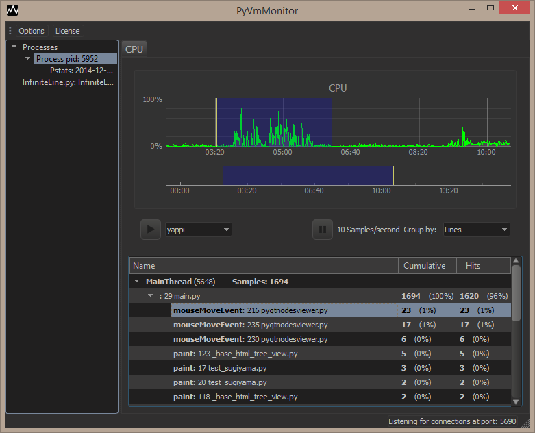

# vscode-pyvmmonitor README

Profile Python from VSCode using PyVmMonitor.

## Features

Provides a command (`Profile Python module with PyVmMonitor`) to start a profile session using PyVmMonitor from within VSCode.

Activating that command (through the `Show All Commands`: `Ctrl+Shift+P`) will provide a list of options on how to profile the code (with yappi, cProfile or just start with the live view connected). 

Selecting one of those will create a terminal and execute the needed command line to launch the current file opened in the editor and attach `PyVmMonitor` to it.

## Requirements

PyVmMonitor: http://www.pyvmmonitor.com must be already installed for this extension to work properly.

## Developing

To develop this extension, install:
- VSCode (https://code.visualstudio.com)
- Node.js (https://nodejs.org/en/)

Download the sources in a "vscode-pyvmmonitor" folder, then go to the folder with "vscode-pyvmmonitor" sources and run "npm install" (after this it'll be possible to debug the project from within VSCode).

## Release Notes

See See [CHANGELOG.md](CHANGELOG.md) for information on releases.
